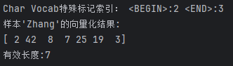
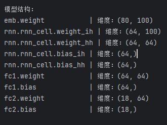
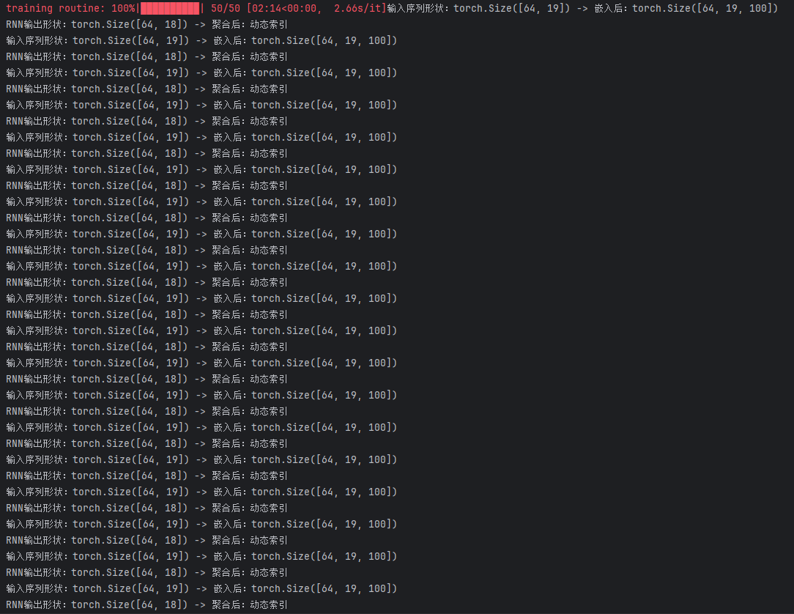
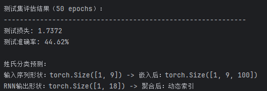
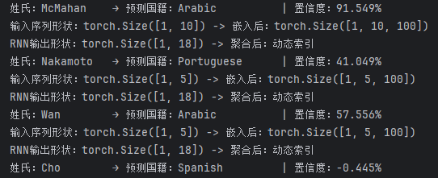
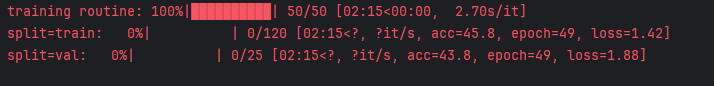
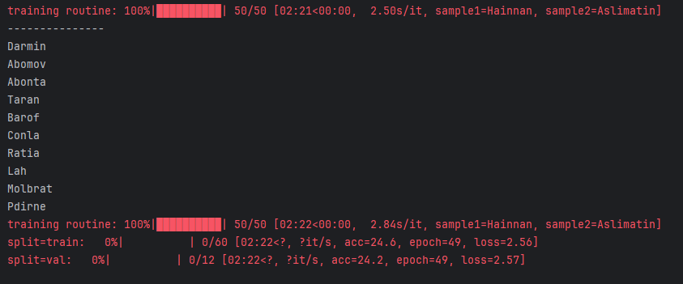
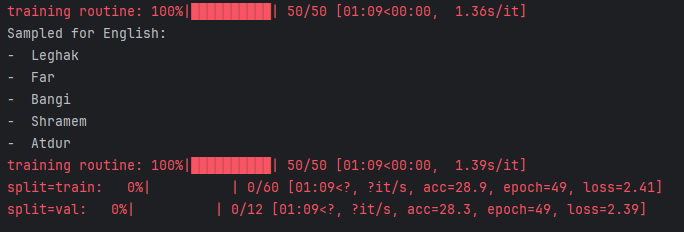

# homework5
# 代码结果
# 01 数据加载与预处理

# 模型初始化

# RNN序列处理验证

# 模型性能评估

# 推理能力验证

# 无条件姓氏生成

# 有条件姓氏生成

# 问题与答案

## ① 两个模型的核心差异体现在什么机制上？
**答案：B. 是否考虑国家信息作为生成条件**

---

## ② 在条件生成模型中，国家信息通过什么方式影响生成过程？
**答案：B. 作为GRU的初始隐藏状态**

---

## ③ 文件2中新增的 `nation_emb` 层的主要作用是？
**答案：B. 将国家标签转换为隐藏状态初始化向量**

---

## ④ 对比两个文件的 `sample_from_model` 函数，文件2新增了哪个关键参数？
**答案：B. nationalities**